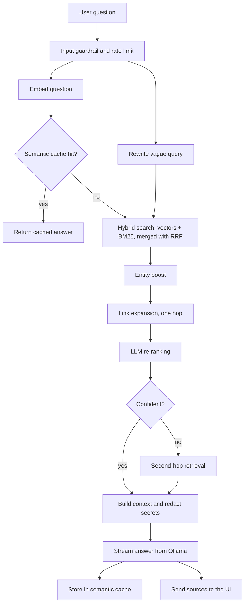
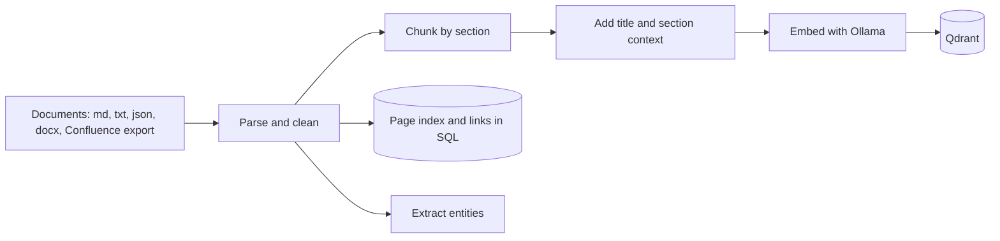

# Architecture

## Components

| Component | Technology | Role |
|-----------|-----------|------|
| Frontend | React, TypeScript, Vite, Tailwind (served by nginx) | Chat UI, conversation sidebar, source citations, admin feedback dashboard |
| Backend | FastAPI (Python 3.11) | API, RAG pipeline, ingestion, auth |
| Vector store | Qdrant | Chunk vectors and metadata, semantic cache collection |
| Model server | Ollama | Chat model, embedding model (`nomic-embed-text`, 768 dimensions), re-ranking and query rewriting |
| Relational store | SQLite (default) or PostgreSQL | Users, conversations, feedback, page index, page links, analytics |
| Optional | Redis, ELK, OpenTelemetry, k6 | Shared cache, logs, traces, load tests |

All containers share a private compose network. Only the frontend, backend, Qdrant, and Ollama publish ports to the host, which you can restrict in `docker-compose.yml`.

## Answering a question

The orchestration lives in `backend/app/services/rag.py` (`RAGPipeline.stream`). The steps:

1. **Embed and rewrite.** The question is embedded while a short, vague question is rewritten into a better search query in parallel.
2. **Semantic cache.** A question close enough to a previous one (cosine similarity above `SEMANTIC_CACHE_THRESHOLD`) returns the stored answer without touching retrieval or the LLM.
3. **Hybrid retrieval.** Qdrant vector search and an in-memory BM25 index each return candidates. The two rankings are merged with reciprocal rank fusion. Results from the rewritten query are merged in.
4. **Entity boost and link expansion.** Pages that mention entities found in the question are added, and pages linked from the top results are pulled in.
5. **Re-ranking.** The local LLM scores the top candidates for relevance. If scoring is slow, the pipeline falls back to the retrieval order.
6. **Multi-hop.** If confidence in the top results is low, a second retrieval hop runs with an expanded query.
7. **Context and generation.** The top chunks are trimmed, run through the content guardrail (which redacts credentials and personal data), and sent to Ollama with the conversation history. Tokens stream back to the browser over server-sent events.
8. **Sources.** The final event carries the cited sources shown as cards under the answer.

## Ingestion

- `POST /api/ingest/local` reads the mounted `test_docs/` folder. `POST /api/upload` accepts files from the UI. `POST /api/ingest/push-pages` accepts pages pushed by another tool.
- Incremental runs compare each page's last-modified timestamp with the page index and skip unchanged pages.
- Chunks store the enriched text (used for embedding and BM25) and the original text (used for citations).
- An optional **OKF** mode (`use_okf` on push-pages) asks the local model to rewrite each page into structured Markdown before chunking.

## Security model

- Optional API key on ingest routes, JWT login for users, optional OIDC single sign-on, and space-level access claims.
- Input guardrail against prompt-injection phrases, a content guardrail that redacts secrets and personal data in retrieved context, and a system prompt that refuses to reveal credentials.
- Rate limiting per client, security headers, restricted CORS origins, and path checks on the local-ingest folder.
- The LLM client has retries and a circuit breaker so a stopped Ollama fails fast.

## Scaling notes

- The default deployment is single-host. For more than one backend replica, use PostgreSQL (`DATABASE_URL`) and Redis (`REDIS_ENABLED=true`).
- The `k8s/` folder has example manifests. Review names, namespaces, hostnames, and secrets before using them.
- Model speed dominates latency. A GPU host or a smaller model reduces it the most.
