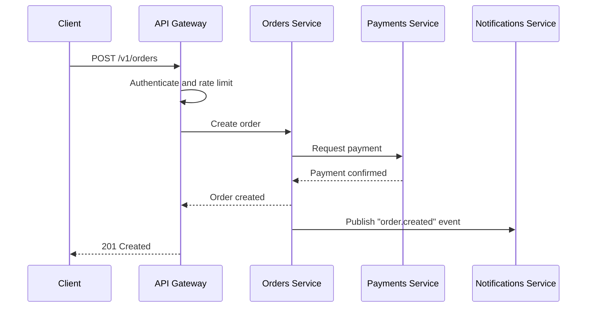

# Platform Architecture Overview

The Orbit Labs platform is a set of small services behind a single API gateway.

## Services

| Service | Responsibility | Data store |
|---------|----------------|-----------|
| API Gateway | Authentication, rate limiting, routing | Redis |
| Orders Service | Create and track customer orders | PostgreSQL |
| Payments Service | Charge cards, refunds, reconciliation | PostgreSQL |
| Notifications Service | Email and push messages | Message queue |
| Search Service | Product and order search | OpenSearch |

## Request Flow

## Data Stores

- **PostgreSQL 16**: primary store for orders and payments. One primary and two read replicas.
- **Redis 7**: rate-limit counters and session cache.
- **Message queue**: asynchronous events between services. Messages are retained for 7 days.
- **OpenSearch**: search indexes, rebuilt nightly from PostgreSQL.

## Availability Targets

- Public API: 99.9% monthly availability.
- Recovery time objective (RTO): 1 hour. Recovery point objective (RPO): 5 minutes.
- Database backups run every night and transaction logs are archived continuously.

## Observability

- Metrics: Prometheus, with dashboards named "Service Health" and "Database Health".
- Logs: structured JSON, shipped to the central log index and kept for 30 days.
- Traces: OpenTelemetry, sampled at 10% of requests.
- Alerts: page the on-call engineer when the error rate is above 2% for 5 minutes.

## Design Principles

1. Each service owns its data. No service reads another service's database.
2. Prefer asynchronous events over synchronous calls between services.
3. Every endpoint is idempotent or accepts an idempotency key.
4. Design for failure: use timeouts, retries with backoff, and circuit breakers.
